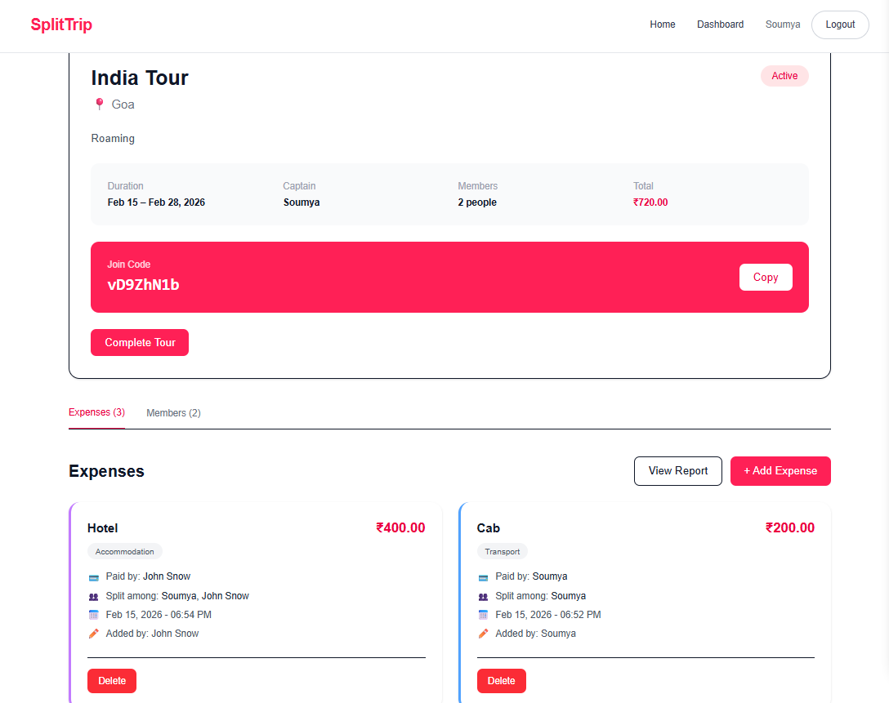
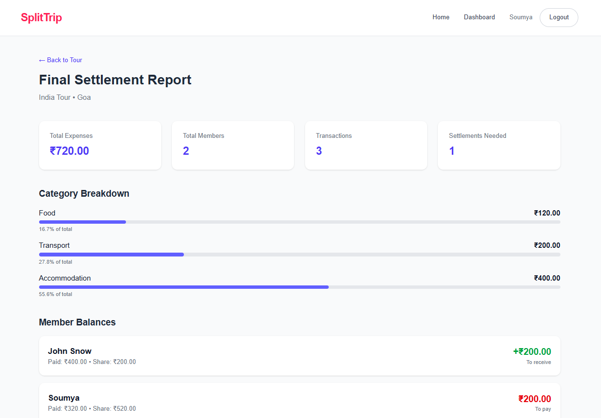

# SplitTrip - Group Tour Expense Tracker

<div align="center">
  
  
  
  
</div>

[](https://split-trip-frontend.vercel.app)

A full-stack web application for tracking and settling group tour expenses. Perfect for friends traveling together who want to easily split costs and settle payments.

## 📸 Application Preview


### 📊 Dashboard & Tour Management

<p align="center">
  
</p>
<p align="center"><b>Dashboard — View & Manage Tours</b></p>

---

### 💵 Expense Tracking

<p align="center">
  
</p>
<p align="center"><b>Tour Details — Add & Track Expenses</b></p>

---

### 📈 Final Settlement Report

<p align="center">
  
</p>
<p align="center"><b>Optimized Settlement & Balance Summary</b></p>


## 🌟 Key Features

### 🔐 Authentication

- Secure user registration & login  
- JWT-based authentication  
- Protected API routes  
- Password hashing with bcrypt  

---

### 🧳 Tour Management

- Create tours with destination, dates, and description  
- Unique 8-character join codes (generated via nanoid)  
- Join tours using invite code  
- Tour Captain privileges  

---

### 💵 Expense Management

- Add expenses with:
  - Category  
  - Amount  
  - Payer  
  - Participants  
- Equal split among selected members  
- Real-time updates during tour  

---

### 📊 Settlement & Reports

- Total tour budget  
- Per-person share  
- Paid vs Owed breakdown  
- Optimized settlement instructions  
- Category-wise expense summary  
- Complete expense history  

---

## 🧠 Settlement Algorithm

SplitTrip uses a **greedy optimization algorithm**:

1. Calculate each member’s net balance  
2. Separate creditors & debtors  
3. Match largest creditor with largest debtor  
4. Minimize total number of transactions  

This reduces complexity from **O(n²)** to approximately **O(n log n)**.

---

## 🏗 Tech Stack

### Backend

- Node.js  
- Express.js  
- MongoDB (Mongoose ODM)  
- JWT Authentication  
- bcrypt  
- nanoid  
- CORS  
- dotenv  

---

### Frontend

- React (Hooks)  
- React Router v6  
- Axios  
- Vite  
- TailwindCSS  
- date-fns  

---

### Deployment

- Frontend → Vercel  
- Backend → Render  
- Database → MongoDB Atlas  

## Project Structure

```
soumyajitpaul-git-splittrip/
│
├── backend/                 (Express.js API - MVC)
│   ├── controllers/
│   ├── middleware/
│   ├── models/
│   └── routes/
│
└── frontend/
    └── viteFr/              (React + Vite)
        └── src/
            ├── components/
            ├── contexts/
            ├── pages/
            └── utils/

```

## Installation & Setup

### Prerequisites
- Node.js (v16 or higher)
- MongoDB (local or Atlas)

### Backend Setup

1. Navigate to backend directory:
```bash
cd backend
```

2. Install dependencies:
```bash
npm install
```

3. Create `.env` file from example:
```bash
cp .env.example .env
```

4. Configure environment variables in `.env`:
```env
PORT=5000
MONGODB_URI=mongodb://localhost:27017/splittrip
JWT_SECRET=your_secret_key_here_change_in_production
JWT_EXPIRE=30d
FRONTEND_URL=http://localhost:5173
```

5. Start the server:
```bash
# Development mode with auto-reload
npm run dev

# Production mode
npm start
```

Server will run on `http://localhost:5000`

### Frontend Setup

1. Navigate to frontend directory:
```bash
cd frontend/viteFr
```

2. Install dependencies:
```bash
npm install
```

3. Start development server:
```bash
npm run dev
```

Frontend will run on `http://localhost:5173`

## API Endpoints

### Authentication
- `POST /api/auth/signup` - Register new user
- `POST /api/auth/login` - Login user
- `GET /api/auth/me` - Get current user (protected)

### Tours
- `GET /api/tours` - Get all tours for user (protected)
- `POST /api/tours` - Create new tour (protected)
- `GET /api/tours/:id` - Get tour details (protected)
- `POST /api/tours/join/:joinCode` - Join tour with code (protected)
- `PATCH /api/tours/:id/status` - Update tour status (captain only)
- `GET /api/tours/:id/report` - Get settlement report (protected)

### Expenses
- `POST /api/expenses` - Create expense (protected)
- `GET /api/expenses/tour/:tourId` - Get tour expenses (protected)
- `GET /api/expenses/:id` - Get single expense (protected)
- `PUT /api/expenses/:id` - Update expense (creator/captain only)
- `DELETE /api/expenses/:id` - Delete expense (creator/captain only)

## Usage Workflow

1. **Sign Up / Login**
   - Create account or login with existing credentials

2. **Create a Tour**
   - Click "Create New Tour"
   - Fill in tour details (name, destination, dates)
   - System generates unique 8-character join code

3. **Invite Members**
   - Share the join code with tour members
   - Members use "Join Tour" to enter

4. **Track Expenses**
   - Add expenses as they occur
   - Select payer and participants for each expense
   - Categorize expenses (food, transport, accommodation, etc.)

5. **View Reports**
   - Click "View Report" anytime during or after tour
   - See total expenses, category breakdown
   - View individual balances
   - Get optimized settlement instructions

6. **Settle Payments**
   - Follow settlement instructions to minimize transactions
   - Complete payments outside the app

## Settlement Algorithm

The app uses a greedy algorithm to minimize the number of transactions needed:

1. Calculate net balance for each member (amount paid - share owed)
2. Separate members into creditors (to receive) and debtors (to pay)
3. Match largest creditor with largest debtor
4. Settle the smaller amount
5. Repeat until all balanced

This reduces complexity from O(n²) to approximately O(n log n) transactions.

## Security Features

- Passwords hashed with bcrypt
- JWT-based authentication
- Protected routes require valid token
- Authorization checks for sensitive operations
- Input validation on all forms

## Future Enhancements

- [ ] Custom split ratios (not just equal)
- [ ] Receipt image uploads
- [ ] Export reports to PDF
- [ ] Email notifications
- [ ] Multi-currency support
- [ ] Payment integration (UPI, PayPal)
- [ ] Expense editing history
- [ ] Tour templates
- [ ] Mobile app

## Contributing

1. Fork the repository
2. Create feature branch (`git checkout -b feature/AmazingFeature`)
3. Commit changes (`git commit -m 'Add AmazingFeature'`)
4. Push to branch (`git push origin feature/AmazingFeature`)
5. Open Pull Request

## License

This project is licensed under the MIT License.

## Support

For issues or questions, please open an issue on GitHub.

---

Built with ❤️ for travelers who hate complicated expense splitting